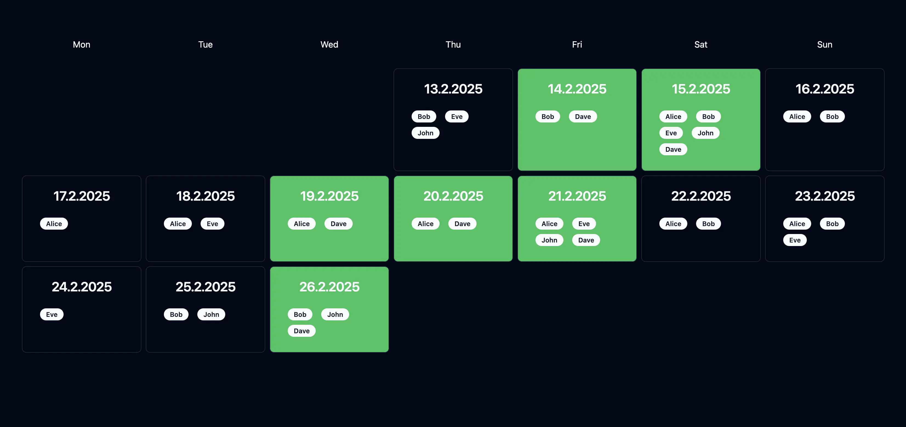

# Day Finder

A simple calendar to find a day where everyone from your friend group has time




### Usage

#### Directly

```bash
npm install
npm run build
node .output/server/index.mjs
```

#### Docker

```bash
./docker_run.sh
```

or

```bash
docker build -t day-finder .
docker run -p 3000:3000 -d day-finder
```

#### Attention

data is saved only in memory and will on restart be lost, but that is wanted to keep it minimal and simple
